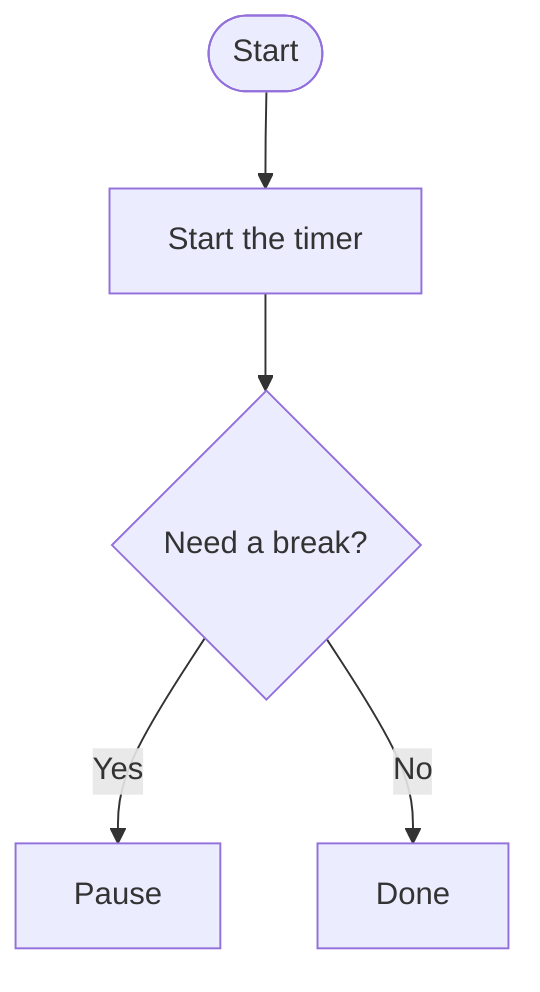

# Hello World

This is the content of the post.

```js
const x = 3
```

- 1
- 2
  - 3
  - 4
    - 5
    - 6


## Mermaid example


```mermaid
flowchart TD
  Start([Start]) --> Timer[Start the timer]
  Timer --> Decide{Need a break?}
  Decide -- Yes --> Pause[Pause]
  Decide -- No --> Done[Done]
```
